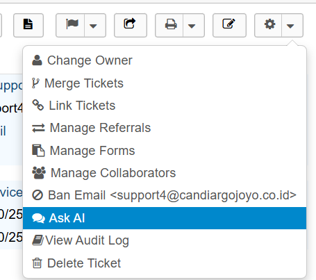

# osTicket AI Plugin

This plugin is an extension for [osTicket](https://osticket.com/) that adds AI capabilities to help agents respond to support tickets more efficiently.  
Currently, it supports **Google Gemini** as the AI model and provides a simple popup interface for generating AI-powered responses.  
In future releases, planned features include **automated ticket responses** and more advanced AI-assisted workflows.

## 🚀 Features
- Popup interface for agents to ask questions and receive AI-generated answers.
- API Key configuration directly from the plugin settings panel.
- Model selection for different AI capabilities.
- Language support for AI responses.
- Provides a structured response format, including steps and answers.
- No need for additional dependencies; it uses osTicket's built-in AJAX and templating system.
- Support osTicket versions 1.17 and above.

Gemini Models :
- Gemini 1.5
- Gemini 2.5 Flash Lite
- Gemini 2.5 Flash
- Gemini 2.5 Pro

## 📸 Screenshots - How to Use
1. **Plugin Management** — Navigate to the **Admin Panel > Manage > Plugins** and select **Ask AI Plugin** to install.
   

2. **Create Plugin Instance** — Configure your plugin instance by setting the API Key, model, and preferred response language.
     
   

3. **Activate Plugin** — Once created, activate the plugin so it’s ready to use.
   

4. **Ticket View** — Open a ticket in the agent panel. You will see the "Ask AI" button under the "More" dropdown.
   

5. **AI Response Popup** — Click the link to open a popup where the AI generates step-by-step solutions for the ticket issue.
   

## 📂 Project Structure
```
ASK_AI/
├── templates/
│   └── ticket-askai.tmpl.php  # Ticket reply template for AI
├── askai.php                  # Main AI request handler
├── config.php                 # Plugin configuration
├── plugin.php                 # Main plugin entry point
├── README.md                  # Plugin documentation
└── LICENSE                    # License file
```
> **Note:** The `.ide-helper.php` file is for development purposes only and is not required in production.

## ⚙️ Installation
1. Make sure you have a compatible version of **osTicket** installed.
2. Clone this repository into the `include/plugins` folder in your osTicket installation:
   ```bash
   git clone https://github.com/ravhirizaldi/osticket-ai-plugin.git ASK_AI
   ```
3. Go to **Admin Panel > Manage > Plugins** in osTicket.
4. Enable the **osTicket AI Plugin**.
5. Open the plugin settings and enter your required API Key.
6. Select the AI model you want to use.
7. Set the default language for AI responses.

## 🔧 Configuration
- **API Key**: Required to connect to the AI service.
- **Model**: Choose the AI model you want to use.
- **Default Language**: Set the default language for automated responses.

## 🧩 How It Works
1. A user submits a ticket.
2. An agent opens the ticket and clicks the "Ask AI" button at "More Button > Ask AI".
3. The AI generates a relevant response.
4. The agent can review the AI's response and use the suggestion to fix the problem.

## 🛠 Development

If you want to develop this plugin:

```bash
# Clone repository
git clone https://github.com/ravhirizaldi/osticket-ai-plugin.git
cd osticket-ai-plugin
```

### Recommended Tools
- **[Intelephense](https://intelephense.com/)** — Recommended for PHP development to enable intelligent code completion, type hints, and symbol navigation.  
  After installing it in your IDE (e.g., VSCode), add the following to your `settings.json` so Intelephense can recognize osTicket's core files:

```json
"intelephense.environment.includePaths": [
    "C:/Users/DELL/Documents/CAJ/Code/osticket/include"
]
```

Modify the code as needed, then reload the plugin in osTicket to test your changes.

## 🤝 Contributing
Contributions are welcome. Please fork this repository, create a new branch, and submit a pull request.

## 📜 License
This plugin is released under the **MIT** license. See the [LICENSE](LICENSE) file for details.
